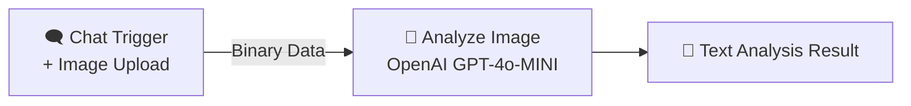
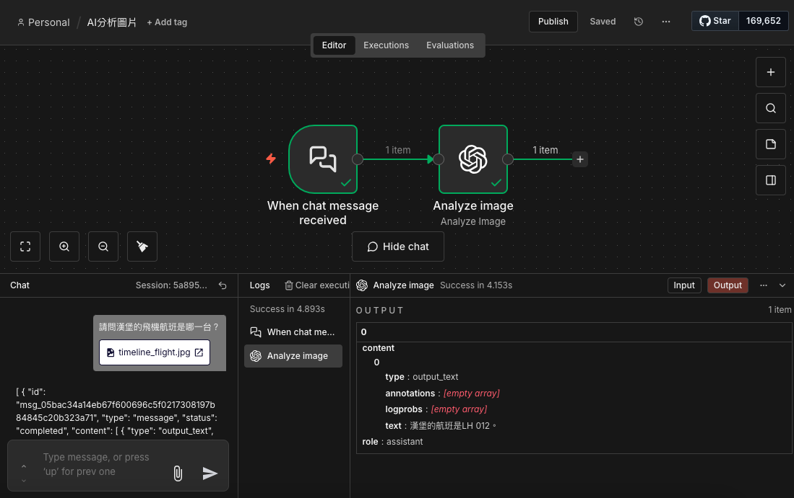
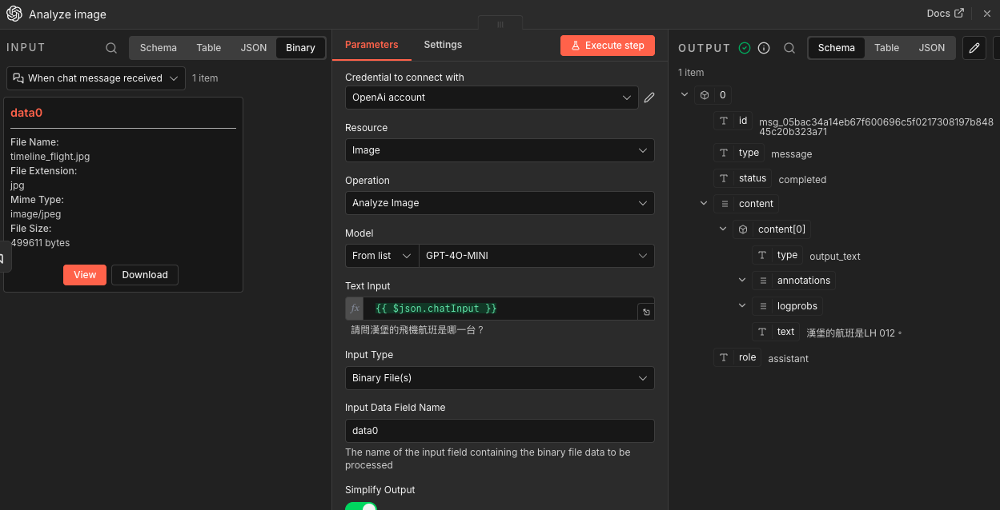
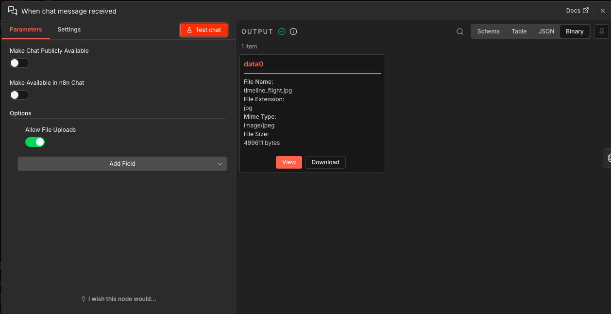

# 🔍 n8n AI Image Analysis: Chat-to-GPT-4o-mini

這是一個強大且直覺的 n8n 自動化工作流，透過 n8n 內建的對話介面 (Chat Interface) 接收使用者上傳的圖片，並利用 OpenAI GPT-4o-MINI 模型進行深度的影像內容分析。

## 📖 流程簡介

本專案實現了「影像即對話」的自動化流程，包含兩個核心步驟：
1. **觸發層**：監聽對話視窗，接收使用者輸入的文字提問與上傳的圖片檔案（Binary Data）。
2. **分析層**：將圖片與問題一併傳送至 OpenAI 視覺模型，進行語意識別、資訊提取或文字分析。

### 核心節點配置
* **When chat message received**: 
    * 啟用 `Allow File Uploads` 選項以接收圖片。
    * 輸出 `data0` 作為圖片的二進位欄位名稱。
* **Analyze Image (OpenAI)**: 
    * **模型**: `GPT-4o-MINI`。
    * **輸入類型**: `Binary File(s)`。
    * **提示詞**: `={{ $json.chatInput }}` (動態結合使用者的提問)。

## 🛠️ 安裝與使用

### 1. 匯入工作流
下載本倉庫中的 `AI分析圖片.json` 檔案，並在您的 n8n 面板選擇 **"Import from File"** 進行匯入。

### 2. 設定 API 憑證
在 `Analyze image` 節點中，點擊 **Credentials** 並新增或選擇您的 OpenAI API Key。

### 3. 開始使用
點擊 n8n 畫面下方的 **"Open chat"**，點擊附件圖示上傳圖片並輸入問題（例如：「請問圖中的飛機航班是哪一台？」），系統將即時回傳分析結果。

## 📊 流程結構

使用 Markdown 內建的 Mermaid 語法呈現流程邏輯：

## 📸 執行截圖範例

