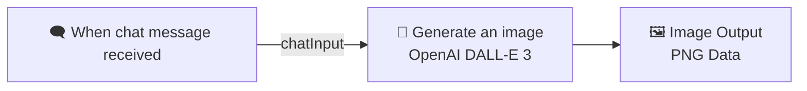
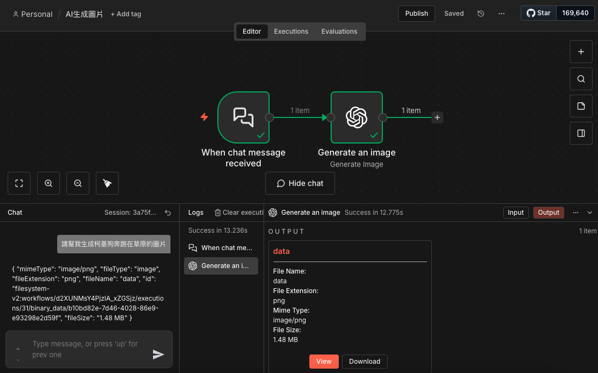
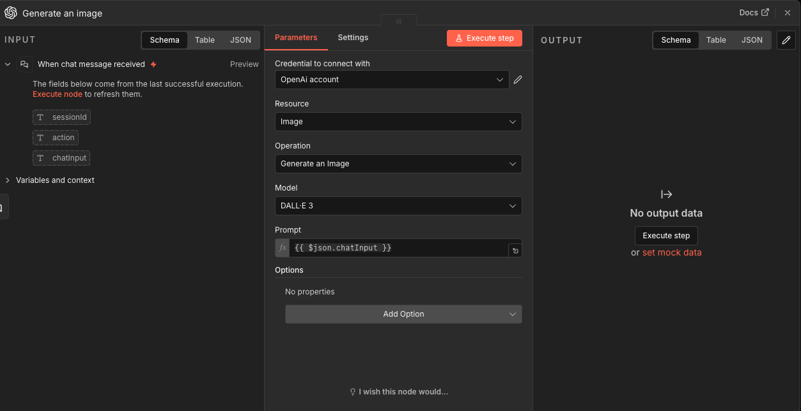

# 🎨 n8n AI Image Generator: Chat-to-DALL·E 3

這是一個極簡且高效的 n8n 自動化工作流，透過 n8n 內建的對話介面 (Chat Interface) 直接驅動 OpenAI DALL·E 3 模型生成影像。

## 📖 流程簡介

本專案將複雜的 AI 算圖流程簡化為兩個核心步驟：
1. **觸發層**：監聽對話視窗輸入的文字指令。
2. **生成層**：將指令傳遞至 OpenAI 節點進行影像運算並回傳結果。

### 核心節點配置
* **When chat message received**: 使用 `chatInput` 作為動態參數。
* **Generate an image (OpenAI)**: 
    * **模型**: `DALL·E 3`
    * **提示詞**: `={{ $json.chatInput }}`
    * **輸出格式**: 二進位圖片數據 (Binary Data)

## 🛠️ 安裝與使用

### 1. 匯入工作流
下載本倉庫中的 `AI生成圖片.json` 檔案，並在您的 n8n 面板選擇 **"Import from File"** 進行匯入。

### 2. 設定 API 憑證
在 `Generate an image` 節點中，點擊 **Credentials** 並新增您的 OpenAI API Key。

### 3. 開始使用
點擊 n8n 畫面下方的 **"Open chat"**，輸入任何描述語（例如：「請幫我生成柯基狗奔跑在草原的圖片」），系統將自動回傳生成的 `.png` 檔案。

## 📊 流程結構

使用 Markdown 內建的 Mermaid 語法呈現流程邏輯：

## 📸 執行截圖範例

*圖：系統根據對話指令自動生成影像之實際畫面*
